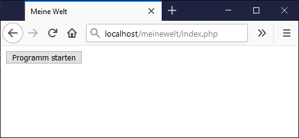

Kapitel 1: Hello world!
=======================

### Voraussetzungen
Das Projekt "`helloworld`" ist in Eclipse angelegt und der Browser zeigt:  

(Nachschlagen:  [Projekt `helloworld` installieren](install.md))

### ...

## Nächstes Kapitel

...
