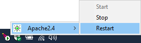

# Entwicklungsumgebung einrichten unter Windows

## Ziele
Installation einer WAMPE:
* (**W**indows)
* **A**pache
* **M**ySQL (später)
* **P**HP
* **E**clipse

## Empfohlene Tools

### 7-Zip
[7-Zip](https://www.7-zip.de/)
&rarr; [Download](https://www.7-zip.de/download.html)
:  

[7-Zip 19.00 für Windows 64-bit .exe](https://7-zip.org/a/7z1900-x64.exe) (1 MB)

### Notepad++
[Notepad++](https://notepad-plus-plus.org/)
&rarr; [Downloads](https://notepad-plus-plus.org/downloads/)
:  

[Notepad++ 7.8.6 64-bit Installer](https://github.com/notepad-plus-plus/notepad-plus-plus/releases/download/v7.8.6/npp.7.8.6.Installer.x64.exe) (4 MB)

### Firefox
[Firefox Browser](https://www.mozilla.org/de/firefox/)
&rarr; [Firefox Browser für Desktop Download](https://www.mozilla.org/de/firefox/new/)
:  

[Firefox Installer.exe](https://www.mozilla.org/de/firefox/download/thanks/) (50 MB)

## Apache

### Herunterladen

[Apache HTTP Server Project](https://httpd.apache.org/)
&rarr; [Download](https://httpd.apache.org/download.cgi)
&rarr; [Windows](https://httpd.apache.org/docs/current/platform/windows.html#down)
&rarr; [Apache Haus](https://www.apachehaus.com/cgi-bin/download.plx)
:  

[Apache 2.4.43 x64 OpenSSL](https://de.apachehaus.com/downloads/httpd-2.4.43-o111g-x64-vc15.zip) (12 MB)

### Entpacken
Entpacken nach `C:\Program Files\Apache24`

### Pfad registrieren
`C:\Program Files\Apache24\conf\httpd.conf`:

    Define SRVROOT "C:/Program Files/Apache24"

### Als Dienst installieren

    httpd.exe -k install
(Quelle: https://httpd.apache.org/docs/2.4/platform/windows.html)

### Verknüpfung zu `ApacheMonitor.exe` in den Autostart
Autostart-Verzeichnis unter Windows 10: `Win+R` &rarr; `shell:startup`

    C:\Program Files\Apache24\bin\ApacheMonitor.exe

### Installation testen
Im Browser aufrufen: [`http://localhost`](http://localhost)

## PHP

### Herunterladen

[PHP](https://www.php.net/)
&rarr; [Downloads](https://www.php.net/downloads)
&rarr; [Windows](https://windows.php.net/download#php-7.4)
:  

[PHP 7.4.5 x64 Thread Safe](https://windows.php.net/downloads/releases/php-7.4.5-Win32-vc15-x64.zip) (25 MB)

### Entpacken
Entpacken nach `C:\Program Files\PHP`

### "PHP's initialization file" (`php.ini`) erzeugen

    cd "C:\Program Files\PHP"
    copy php.ini-development php.ini

### Im Apache registrieren
`C:\Program Files\Apache24\conf\httpd.conf`:

    LoadModule php7_module "C:/Program Files/PHP/php7apache2_4.dll" 
    AddType application/x-httpd-php .php
    PHPIniDir "C:/Program Files/PHP"

### Apache neustarten
Klick auf den ApacheMonitor &rarr; Apache2.4 &rarr; Restart
:  

### Installation testen
`C:\Program Files\Apache24\htdocs\phptest.php`:

    <?php
    echo "Hello world.";
Im Browser aufrufen: [`http://localhost/phptest.php`](http://localhost/phptest.php)

## Eclipse

### Voraussetzungen
Eclipse benötigt [Java](help_install_java.md).

### Herunterladen

[Eclipse Foundation](https://www.eclipse.org/)
&rarr; [Download Packages](https://www.eclipse.org/downloads/packages/)
:  

[Eclipse IDE for PHP Developers, Windows 64-bit 2020-03](https://www.eclipse.org/downloads/download.php?file=/technology/epp/downloads/release/2020-03/R/eclipse-php-2020-03-R-win32-x86_64.zip) (223 MB)

### Entpacken
Entpacken nach `C:\Program Files\Eclipse`

### Installation testen

    C:\Program Files\Eclipse\eclipse.exe

## Git

### Herunterladen

[Git distributed version control system](https://git-scm.com/)
&rarr; [Downloads](https://git-scm.com/downloads)
&rarr; [Windows](https://git-scm.com/download/win)
:  

[64-bit Git for Windows Setup 2.26.2](https://github.com/git-for-windows/git/releases/download/v2.26.2.windows.1/Git-2.26.2-64-bit.exe) (46 MB)

### Installation starten

    Git-2.26.2-64-bit.exe

## Nächstes Kapitel

[Projekt `helloworld` installieren](install.md)
