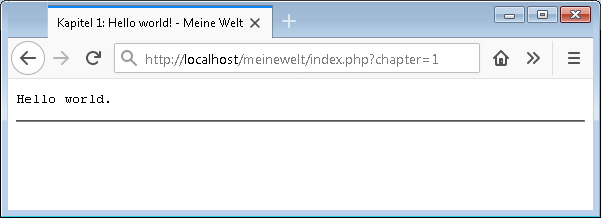

Kapitel 1: Hello world!
=======================

[Meine Welt (Kapitel 1)](http://localhost/meinewelt/index.php?chapter=1)

### Ziele
* Ausgabe mit `echo`
* Variablen
* `for`-Schleife

### Voraussetzungen
Das Projekt "`helloworld`" ist in Eclipse angelegt und der Browser zeigt:  

(Nachschlagen:  [Projekt `helloworld` installieren](install.md))

## Ausgabe

`echo` erwartet eine Zeichenkette und gibt diese auf dem Ausgabegerät (Bildschirm) aus.

In unserem Fall
(Server-[CGI](https://de.wikipedia.org/wiki/Common_Gateway_Interface))
werden alle Ausgaben gesammelt, bevor sie an den Browser übermittelt werden:

    echo "Hello...";
    sleep( 5 );          //Warte 5 Sekunden
    echo "world";
    //(Auch das "Hello" erscheint erst nach 5 Sekunden, wenn die gesamte Seite übertragen wird.)

Um Funktionen (Programmteile) später wiederverwenden zu können ist es empfehlenswert, NIEMALS direkt mit `echo` zu arbeiten. Verwende stattdessen:

    $output .= "Hello world.";

Andere Ausgabearten:
* [Dateien](https://www.php.net/manual/de/function.fopen.php)
* [Webadressen (URLs)](https://www.php.net/manual/de/book.curl.php)

## Variablen

Variablen können alle Datentypen speichern: Strings, Zahlen, Objekte, usw.:

    $vorname = "Hans";
    $lieblingszahl = 42;
    $dbh = new PDO('mysql:host=localhost;dbname=meinewelt');

Variablen ausgeben kannst Du so:

    echo $vorname;

oder so:

    echo "Hallo $vorname!";

oder so:

    echo "Hallo " . $vorname . "!";

Rechnen kannst Du natürlich nur mit Zahlen:

    $summe = $lieblingszahl + 1000;

Übrigens: `$i` um eins erhöhen ("inkrementieren") geht so:

    $i = $i + 1;

Und das braucht man beim Programmieren so oft, dass es dafür eine Kurzschreibweise gibt:

    $i++;

Eine andere Kurzschreibweise für das Hochzählen:

    $i += 1;

## Schleifen

Die `for`-Schleife eignet sich insbesondere für eine vorher festgelegte Zahl von Wiederholungen.

Auf die Zählervariable (z.B. `$i`) kann innerhalb der Schleife zugegriffen werden:

    for ($i = 0; $i < 10; $i++) {
        echo "Runde $i:\n";
    }

Für die Reihe 2,4,6,8,10 kann man auch schreiben:

    echo "2";
    for ($i = 4; $i <= 10; $i += 2) {
        echo ",$i";
    }

Weitere Möglichkeiten, Wiederholungen zu programmieren:
* [`goto`](https://www.php.net/manual/de/control-structures.goto.php)
  (streng verboten, da es zu unleserlichen Programmen führt)
* [`while`-Schleife](https://www.php.net/manual/de/control-structures.while.php):
  Hier steht das Abbruch-Kriterium im Mittelpunkt ("Bis Feierabend: Arbeite").
* [`do`-while-Schleife](https://www.php.net/manual/de/control-structures.do.while.php):
  Wie `while`, nur mit nachgestellter Bedingung ("Arbeite bis Feierabend").
* [`foreach`-Schleife](https://www.php.net/manual/de/control-structures.foreach.php):
  Betrachte nacheinander jedes Element einer Sammlung (z.B. Array).

Jede Schleife lässt sich durch jede andere Schleife ausdrücken (programmieren). Aber das Ergebnis ist nicht immer gleich leserlich.

## Nächstes Kapitel

...
