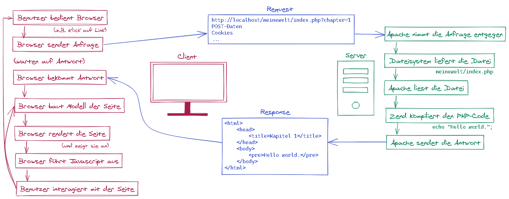

Kapitel 2: Wo befinden wir uns eigentlich?
==========================================

[Meine Welt (Kapitel 2)](http://localhost/meinewelt/index.php?chapter=2)

### Ziele
* Was passiert auf dem Client?
* Was passiert auf dem Server?

### Erforderliche Kenntnisse
* Eine Ausgabe erzeugen mit PHP.
(Nachschlagen:  [Hello world!](chapter1_helloworld.md)

## Wie kommt die Seite in den Browser?

## Was passiert auf dem Client?

Request, Response
Browser, Links, URLs, rendern

## Was passiert auf dem Server?

Request, Response
Apache, kompilieren
